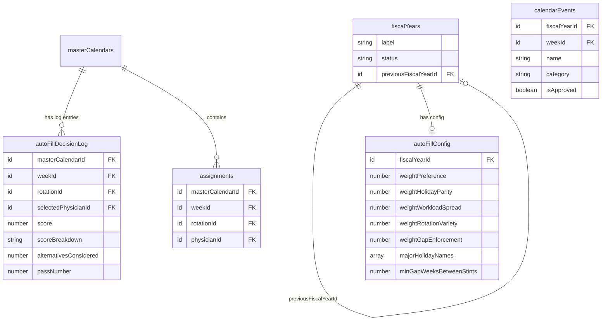

# Smart Calendar Auto-Fill with Constraint Solver and Holiday Parity

## Overview

Replace the current greedy single-pass auto-assign algorithm with a world-class multi-pass constraint solver that produces fair, optimized physician schedules. The new system will be holiday-aware, enforce cross-year parity (Thanksgiving/Christmas rotation), balance workloads beyond cFTE limits, prevent same-week double-booking, and provide transparent scoring so admins can understand and trust the algorithm's decisions.

## Problem Statement

The current `autoAssignCurrentFiscalYearDraft` mutation (`convex/functions/masterCalendar.ts:1436-1607`) uses a greedy sequential algorithm that iterates week-major, rotation-minor, and grabs the first eligible candidate. This approach has 15 identified weaknesses:

1. **No holiday awareness** -- Holiday weeks treated identically to regular weeks
2. **No holiday parity** -- No mechanism to rotate Thanksgiving/Christmas between physicians annually
3. **No same-week conflict prevention** -- A physician can be assigned to multiple rotations in the same week
4. **`minStaff` completely unused** -- Schema field exists but is never checked
5. **Greedy single-pass with no backtracking** -- Locally optimal choices lead to globally poor outcomes; cells left empty
6. **No workload spreading** -- High-headroom physicians are selected repeatedly until exhausted
7. **Deterministic tiebreaker bias** -- `physicianId.localeCompare()` means the same physicians consistently win ties
8. **No rotation variety enforcement** -- A physician could get the same rotation for all their weeks
9. **No gap/spacing enforcement** -- Beyond `maxConsecutiveWeeks`, no minimum rest between stints
10. **Yellow weeks have no weighted penalty** -- Yellow is sorted after green but no scoring penalty
11. **No conference week protection** -- Institutional conferences (CHEST, SCCM, ATS) not auto-protected
12. **Rotation iteration order bias** -- Earlier `sortOrder` rotations get first pick of physicians
13. **No prior-year data** -- Cannot balance across fiscal years
14. **Single-pass, no optimization** -- No iterative improvement after initial fill
15. **No weekend/call burden tracking** -- No distinction between heavy and light weeks

## Proposed Solution

### Architecture: Three-Layer Algorithm

```
Layer 1: Hard Constraint Filter
  - Rotation eligibility (no avoid, has cFTE target)
  - cFTE headroom (would not exceed target)
  - Week availability (red = blocked)
  - Max consecutive weeks
  - Same-week conflict prevention (1 rotation per physician per week)

Layer 2: Soft Constraint Scorer (0-100 score per candidate)
  - Week preference (green=100, yellow=40)
  - Rotation preference rank (rank 1=100, rank 8=20)
  - cFTE headroom utilization (higher headroom = higher score)
  - Holiday parity (physician who worked this holiday last year = -50)
  - Workload spread (fewer total weeks assigned = +bonus)
  - Rotation variety (haven't done this rotation recently = +bonus)
  - Gap enforcement (weeks since last rotation stint = +bonus)
  - Deprioritize flag (deprioritized = -30)

Layer 3: Multi-Pass Optimization
  - Pass 1: Fill all cells using scored candidates
  - Pass 2: Identify unfilled cells and relax soft constraints
  - Pass 3: Swap optimization -- improve global score by swapping assignments between physicians
  - Quality metrics: overall score, holiday parity score, cFTE variance, preference satisfaction %
```

### Key Design Decisions

1. **Prior-year loading**: Add a `previousFiscalYearId` optional field to `fiscalYears` table. When auto-fill runs, load the previous FY's published calendar assignments for holiday parity context.

2. **Holiday identification**: Query `calendarEvents` for approved `federal_holiday` events in the target FY. Tag weeks containing Thanksgiving and Christmas as "major holidays" requiring parity enforcement.

3. **Same-week tracking**: Maintain a `weekToPhysician` map (weekNumber -> Set<physicianId>) to prevent double-booking.

4. **Algorithm parameters**: Store configurable weights in a new `autoFillConfig` table so admins can tune the algorithm without code changes.

5. **Decision log**: Record why each physician was selected for each cell (score breakdown, alternatives considered) for admin transparency.

6. **Incremental re-fill**: Support running auto-fill on a partially-filled calendar, respecting manually-placed assignments as immutable anchors.

## Technical Approach

### Schema Changes

```typescript
// New table: links fiscal years for prior-year context
// Add to fiscalYears table:
previousFiscalYearId: v.optional(v.id("fiscalYears")),

// New table: algorithm configuration per fiscal year
autoFillConfig: defineTable({
  fiscalYearId: v.id("fiscalYears"),
  // Soft constraint weights (0-100)
  weightPreference: v.number(),     // default: 30
  weightHolidayParity: v.number(),  // default: 25
  weightWorkloadSpread: v.number(), // default: 20
  weightRotationVariety: v.number(),// default: 15
  weightGapEnforcement: v.number(), // default: 10
  // Holiday parity settings
  majorHolidayNames: v.array(v.string()), // ["Thanksgiving", "Christmas"]
  // Gap settings
  minGapWeeksBetweenStints: v.number(), // default: 2
  // Updated by admin
  updatedAt: v.number(),
  updatedBy: v.optional(v.id("physicians")),
})
  .index("by_fiscalYear", ["fiscalYearId"]),

// New table: decision log for transparency
autoFillDecisionLog: defineTable({
  masterCalendarId: v.id("masterCalendars"),
  weekId: v.id("weeks"),
  rotationId: v.id("rotations"),
  selectedPhysicianId: v.id("physicians"),
  score: v.number(),
  scoreBreakdown: v.string(),      // JSON: { preference: 30, parity: 25, ... }
  alternativesConsidered: v.number(), // how many candidates were eligible
  passNumber: v.number(),          // which pass assigned this cell (1, 2, or 3)
  createdAt: v.number(),
})
  .index("by_calendar", ["masterCalendarId"])
  .index("by_calendar_week", ["masterCalendarId", "weekId"]),
```

### Implementation Phases

#### Phase 1: Foundation -- Data Model and Prior-Year Loading

**Goal:** Add schema changes, prior-year linking, holiday identification, and same-week conflict prevention.

##### Backend changes

- [x] Add `previousFiscalYearId` optional field to `fiscalYears` table in `convex/schema.ts`
- [x] Add `autoFillConfig` table to `convex/schema.ts`
- [x] Add `autoFillDecisionLog` table to `convex/schema.ts`
- [x] Create `convex/functions/autoFillConfig.ts`:
  - `getAutoFillConfig` query: loads config for current FY (or returns defaults)
  - `upsertAutoFillConfig` mutation: admin sets/updates weights
- [x] Create `convex/lib/autoFill.ts` with core types:

```typescript
// convex/lib/autoFill.ts

export interface ScoredCandidate {
  physicianId: string;
  totalScore: number;
  breakdown: {
    preference: number;
    holidayParity: number;
    workloadSpread: number;
    rotationVariety: number;
    gapEnforcement: number;
    deprioritize: number;
  };
  availability: Availability;
  headroom: number;
}

export interface AutoFillConfig {
  weightPreference: number;
  weightHolidayParity: number;
  weightWorkloadSpread: number;
  weightRotationVariety: number;
  weightGapEnforcement: number;
  majorHolidayNames: string[];
  minGapWeeksBetweenStints: number;
}

export const DEFAULT_AUTO_FILL_CONFIG: AutoFillConfig = {
  weightPreference: 30,
  weightHolidayParity: 25,
  weightWorkloadSpread: 20,
  weightRotationVariety: 15,
  weightGapEnforcement: 10,
  majorHolidayNames: ["Thanksgiving Day", "Christmas Day"],
  minGapWeeksBetweenStints: 2,
};
```

- [x] Create `convex/lib/autoFillHolidays.ts`:
  - `identifyHolidayWeeks(calendarEvents, weekId)` -- returns Map<weekId, holidayName[]>
  - `loadPriorYearHolidayAssignments(ctx, previousFiscalYearId)` -- returns Map<holidayName, physicianId[]> of who worked each major holiday last year
- [x] Add `setPreviousFiscalYear` mutation to `convex/functions/fiscalYears.ts`:
  - Admin selects which prior FY to link for parity context
- [x] Add same-week conflict tracking utility to `convex/lib/autoFill.ts`:
  - `buildWeekToPhysicianMap(assignments)` -- returns Map<weekNumber, Set<physicianId>>
  - Used to prevent assigning a physician to 2 rotations in the same week

**Files created:**
- `convex/functions/autoFillConfig.ts`
- `convex/lib/autoFill.ts`
- `convex/lib/autoFillHolidays.ts`

**Files modified:**
- `convex/schema.ts` (add `autoFillConfig`, `autoFillDecisionLog` tables, add `previousFiscalYearId` to fiscalYears)
- `convex/functions/fiscalYears.ts` (add `setPreviousFiscalYear` mutation)

**Success criteria:**
- [ ] Schema deploys with new tables
- [ ] Admin can link a prior FY to the current FY
- [ ] Admin can view/edit auto-fill config weights
- [ ] Holiday weeks correctly identified from calendarEvents
- [ ] Prior-year holiday assignments correctly loaded
- [ ] Same-week tracking utility works with test data

---

#### Phase 2: Multi-Pass Constraint Solver Core

**Goal:** Replace the greedy algorithm with a scored multi-pass solver that handles all hard constraints and uses soft constraint scoring.

##### Backend changes

- [x] Create `convex/lib/autoFillScorer.ts` -- the scoring engine:

```typescript
// convex/lib/autoFillScorer.ts

export function scoreCandidate(params: {
  physician: { physicianId: string; availability: Availability; headroom: number };
  rotation: { rotationId: string; cftePerWeek: number };
  week: { weekNumber: number; holidayNames: string[] };
  preferences: { preferenceRank: number | null; deprioritize: boolean };
  context: {
    config: AutoFillConfig;
    priorYearHolidayMap: Map<string, string[]>;
    weekCountByPhysician: Map<string, number>;
    rotationCountByPhysician: Map<string, Map<string, number>>;
    lastRotationWeekByPhysician: Map<string, Map<string, number>>;
    totalPhysicians: number;
    totalWeeksToFill: number;
  };
}): ScoredCandidate
```

  - Preference score: green=100, yellow=40, scaled by rank (rank 1=100%, rank 8=25%)
  - Holiday parity: if this is a major holiday week AND physician worked this holiday last year, apply large penalty
  - Workload spread: bonus for physicians with fewer total assigned weeks (encourages even distribution)
  - Rotation variety: bonus if physician hasn't done this rotation recently
  - Gap enforcement: bonus for larger gaps since last stint on this rotation
  - Deprioritize: fixed penalty when flag is set
  - Final score = weighted sum normalized to 0-100

- [x] Create `convex/lib/autoFillSolver.ts` -- the multi-pass solver:

```typescript
// convex/lib/autoFillSolver.ts

export interface AutoFillResult {
  assignments: Array<{
    weekId: string;
    rotationId: string;
    physicianId: string;
    score: number;
    breakdown: ScoredCandidate["breakdown"];
    passNumber: number;
  }>;
  metrics: AutoFillMetrics;
  unfilled: Array<{ weekId: string; rotationId: string; reason: string }>;
}

export interface AutoFillMetrics {
  totalCells: number;
  filledCells: number;
  unfilledCells: number;
  avgScore: number;
  holidayParityScore: number;       // 0-100
  cfteVariance: number;             // std dev of cFTE utilization
  preferencesSatisfied: number;     // % of assignments on green weeks
  preferencesViolated: number;      // % of assignments on yellow weeks
  workloadStdDev: number;           // std dev of total weeks per physician
}

export async function runAutoFill(params: {
  weeks: Doc<"weeks">[];
  rotations: Doc<"rotations">[];
  physicians: Doc<"physicians">[];
  existingAssignments: Doc<"assignments">[];
  availabilityMap: Map<string, Map<string, Availability>>;
  preferenceMap: Map<string, Map<string, RotationPreference>>;
  targetCfteMap: Map<string, number>;
  clinicCfteMap: Map<string, number>;
  holidayWeeks: Map<string, string[]>;
  priorYearHolidayMap: Map<string, string[]>;
  config: AutoFillConfig;
  anchorPhysicianIds?: Set<string>; // manually-placed assignments to preserve
}): AutoFillResult
```

  **Pass 1: Scored Fill** (week-shuffled, rotation-shuffled to eliminate ordering bias)
  - Shuffle iteration order of weeks (deterministic seed based on FY ID for reproducibility)
  - For each empty cell:
    - Filter candidates by hard constraints (red, avoid, cFTE, consecutive, same-week)
    - Score remaining candidates
    - Select highest-scoring candidate
    - Update running state

  **Pass 2: Relaxed Fill** (for unfilled cells from Pass 1)
  - Relax soft constraints: allow lower-scoring placements
  - Try filling remaining empty cells with any hard-constraint-eligible physician
  - Track which cells still can't be filled and why

  **Pass 3: Swap Optimization** (improve global metrics)
  - For each assigned cell, check if swapping with another physician improves global score
  - Use hill-climbing: accept swaps that improve total schedule score
  - Max iterations to prevent infinite loops
  - Never swap manually-anchored assignments

- [x] Update `autoAssignCurrentFiscalYearDraft` mutation in `convex/functions/masterCalendar.ts`:
  - Keep the same public API (`args: {}, returns: { message, assignedCount, remainingUnstaffedCount }`)
  - Add new return fields: `metrics` object with quality scores
  - Replace greedy loop with call to `runAutoFill()`
  - Write decision log entries for each assignment
  - Audit log the auto-fill run with metrics summary

- [x] Add `assignmentSource` field to assignments for undo support:
  - Add `assignmentSource: v.optional(v.union(v.literal("auto"), v.literal("manual"), v.literal("import")))` to assignments in `convex/schema.ts`
  - Auto-fill sets `assignmentSource: "auto"`, manual edits set `"manual"`, imports set `"import"`
  - Add `clearAutoFilledAssignments` mutation: clears all `assignmentSource: "auto"` assignments for a given calendar

- [x] Add hard constraint: same-week double-booking prevention
  - Before assigning, check `weekToPhysicianMap` to ensure physician isn't already assigned to another rotation in that week
  - Update map after each assignment

- [x] Add hard constraint: `minStaff` enforcement
  - After Pass 1, check each rotation-week for `minStaff` compliance
  - If a rotation needs 2+ physicians per week, the grid structure may need to support multiple assignments per cell (or create duplicate cells)
  - For MVP: flag minStaff violations in metrics; handle in Pass 2 by prioritizing understaffed cells

**Files created:**
- `convex/lib/autoFillScorer.ts`
- `convex/lib/autoFillSolver.ts`

**Files modified:**
- `convex/functions/masterCalendar.ts` (replace greedy algorithm with solver call)
- `convex/lib/masterCalendarAssignments.ts` (keep existing helpers, add new exports)

**Success criteria:**
- [ ] All existing hard constraints still enforced (red weeks, avoid rotations, cFTE, consecutive)
- [ ] Same-week double-booking prevented
- [ ] Pass 1 fills majority of cells using scored selection
- [ ] Pass 2 fills remaining cells with relaxed constraints
- [ ] Pass 3 improves global score through swaps
- [ ] Metrics returned to caller (filled/unfilled counts, avg score, parity score)
- [ ] Manually pre-assigned cells preserved as anchors
- [ ] Deterministic results for same input (seeded shuffle)

---

#### Phase 3: Holiday Parity and Fairness Engine

**Goal:** Implement cross-year holiday rotation and advanced fairness scoring.

##### Backend changes

- [x] Implement holiday parity logic in `convex/lib/autoFillHolidays.ts`:

```typescript
// Determines which physician should work each major holiday this year
// based on who worked it last year (rotation pattern)
export function computeHolidayParityScores(params: {
  majorHolidayNames: string[];
  priorYearHolidayAssignments: Map<string, string[]>; // holidayName -> physicianIds
  currentYearCandidates: string[]; // all eligible physicianIds
}): Map<string, Map<string, number>> // physicianId -> holidayName -> parityScore (-50 to +50)
```

  - If physician worked Thanksgiving last year: -50 for Thanksgiving this year, +30 for Christmas this year
  - If physician worked Christmas last year: -50 for Christmas this year, +30 for Thanksgiving this year
  - If physician worked neither: neutral (0)
  - If no prior year data: all physicians start at 0

- [x] Implement workload spreading in `convex/lib/autoFillScorer.ts`:
  - Calculate ideal weeks per physician: `totalRotationWeeks / numPhysicians`
  - Score bonus/penalty based on how far below/above ideal a physician is
  - Factor in cFTE targets (physician with 0.8 cFTE target should have more weeks than 0.4 target)
  - Weighted ideal: `idealWeeks = (targetCfte / avgTargetCfte) * avgWeeksPerPhysician`

- [x] Implement rotation variety scoring in `convex/lib/autoFillScorer.ts`:
  - Track how many weeks of each rotation each physician has been assigned
  - Bonus for rotations the physician hasn't done yet this FY
  - Penalty for over-concentration on one rotation

- [x] Implement gap enforcement in `convex/lib/autoFillScorer.ts`:
  - Track last week number each physician was assigned to each rotation
  - Bonus for larger gaps (e.g., 4+ weeks since last MICU stint)
  - Penalty for gaps below `minGapWeeksBetweenStints`

- [x] Add `getPriorYearHolidaySummary` query to `convex/functions/masterCalendar.ts`:
  - Admin can view who worked each major holiday last year
  - Used for manual verification and context

**Files modified:**
- `convex/lib/autoFillHolidays.ts` (add parity computation)
- `convex/lib/autoFillScorer.ts` (add workload, variety, gap scoring)
- `convex/functions/masterCalendar.ts` (add prior-year summary query)

**Success criteria:**
- [ ] Thanksgiving/Christmas assignments rotate annually between physicians
- [ ] Prior-year holiday data correctly loaded and applied
- [ ] Workload spread std dev < 2 weeks across physicians with similar cFTE targets
- [ ] No physician gets the same rotation for > 40% of their total weeks
- [ ] Gap between rotation stints respects `minGapWeeksBetweenStints`

---

#### Phase 4: Admin UX -- Configuration, Metrics, and Decision Log

**Goal:** Give admins full visibility into the algorithm's behavior and control over its parameters.

##### Frontend changes

- [x] Create `src/components/admin/auto-fill-config-panel.tsx`:
  - 5 weight sliders (preference, holiday parity, workload spread, rotation variety, gap enforcement)
  - Sliders must sum to 100 (or auto-normalize)
  - Major holiday name chips (add/remove)
  - Min gap weeks input
  - Previous FY selector dropdown
  - "Reset to Defaults" button
  - Persists via `upsertAutoFillConfig` mutation

- [x] Create `src/components/admin/auto-fill-metrics-card.tsx`:
  - Shows after auto-fill runs
  - Cards: Filled/Unfilled cells, Avg Score, Holiday Parity Score, cFTE Variance, Preference Satisfaction %
  - Color-coded (green=good, amber=moderate, red=poor)
  - "View Details" expands to full metrics breakdown

- [x] Create `src/components/admin/auto-fill-decision-log.tsx`:
  - Table: Week | Rotation | Assigned To | Score | Pass | Alternatives
  - Click row to see full score breakdown (preference, parity, spread, variety, gap)
  - Filter by: physician, rotation, pass number, score range
  - Sort by: week number, score (asc/desc), rotation
  - Helps admin understand WHY each physician was selected

- [x] Update `src/app/(authenticated)/admin/calendar/page.tsx`:
  - Add "Auto-Fill Settings" button that opens config panel (Sheet or Dialog)
  - After running auto-fill, show metrics card inline
  - Add "View Decision Log" button that opens decision log (Sheet)
  - Add visual indicators on the calendar grid:
    - Cells filled by auto-fill: subtle dot indicator
    - Cells manually placed: no indicator (or lock icon)
    - Holiday weeks: star/calendar icon on the week row header

- [x] Create `src/components/admin/prior-year-holiday-summary.tsx`:
  - Shows who worked each major holiday last year
  - Displayed in the config panel for context
  - Read-only, pulls from published prior FY calendar

**Files created:**
- `src/components/admin/auto-fill-config-panel.tsx`
- `src/components/admin/auto-fill-metrics-card.tsx`
- `src/components/admin/auto-fill-decision-log.tsx`
- `src/components/admin/prior-year-holiday-summary.tsx`

**Files modified:**
- `src/app/(authenticated)/admin/calendar/page.tsx` (integrate config panel, metrics, decision log)

**Success criteria:**
- [ ] Admin can adjust algorithm weights before running auto-fill
- [ ] Admin sees quality metrics after auto-fill runs
- [ ] Admin can view decision log for any cell
- [ ] Admin can see prior-year holiday assignments for context
- [ ] Config persists across sessions
- [ ] Holiday weeks visually identified on calendar grid

---

#### Phase 5: Testing and Quality Assurance

**Goal:** Comprehensive unit and integration tests for the constraint solver.

##### Test files

- [x] Create `tests/autoFillScorer.test.ts`:
  - Test each scoring dimension independently
  - Test weight normalization
  - Test edge cases: no prior year data, single physician, all red weeks
  - Test holiday parity scoring with known prior-year data

- [x] Create `tests/autoFillSolver.test.ts`:
  - Test Pass 1: basic fill with scored selection
  - Test Pass 2: relaxed fill catches Pass 1 gaps
  - Test Pass 3: swap optimization improves global score
  - Test anchor preservation (manually-placed cells not swapped)
  - Test same-week conflict prevention
  - Test deterministic results (same seed = same output)
  - Test edge cases: more rotations than physicians, all weeks red, no cFTE headroom

- [x] Create `tests/autoFillHolidays.test.ts`:
  - Test holiday week identification from calendarEvents
  - Test prior-year loading
  - Test parity score computation
  - Test Thanksgiving/Christmas rotation across years
  - Test when no prior year exists

- [ ] Create `tests/autoFillIntegration.test.ts`:
  - Full pipeline test with realistic data (15 physicians, 8 rotations, 52 weeks)
  - Verify all hard constraints satisfied
  - Verify metrics are within acceptable ranges
  - Verify holiday parity is maintained

- [ ] Update existing tests in `tests/masterCalendarAssignments.test.ts`:
  - Ensure existing tests still pass with refactored code
  - Add tests for new helper functions

**Files created:**
- `tests/autoFillScorer.test.ts`
- `tests/autoFillSolver.test.ts`
- `tests/autoFillHolidays.test.ts`
- `tests/autoFillIntegration.test.ts`

**Success criteria:**
- [ ] All existing 66 tests still pass
- [ ] New test files cover all scoring dimensions
- [ ] Integration test verifies end-to-end with realistic data
- [ ] Edge case tests cover degenerate scenarios
- [ ] Holiday parity tests verify cross-year correctness

---

#### Phase 6: AI Enhancement (Future / Optional)

**Goal:** Use LLM assistance for hard-to-fill cells and schedule optimization suggestions.

> **Note:** This phase is optional and can be deferred. The constraint solver in Phases 1-5 should handle 95%+ of scheduling needs. AI enhancement is for the remaining edge cases.

- [ ] Create `convex/functions/autoFillAI.ts`:
  - `suggestAssignmentsForUnfilledCells` action: sends unfilled cells + constraints to Claude API
  - Claude analyzes why cells are unfilled and suggests constraint relaxations
  - Returns suggestions with explanations for admin review
- [ ] Create `src/components/admin/ai-fill-suggestions.tsx`:
  - Shows unfilled cells with AI-generated suggestions
  - Admin can accept/reject each suggestion
  - Each suggestion includes reasoning
- [ ] Add to auto-fill flow:
  - After Passes 1-3, if cells remain unfilled, offer "Get AI suggestions"
  - Admin reviews and accepts suggestions one by one

**Files created:**
- `convex/functions/autoFillAI.ts`
- `src/components/admin/ai-fill-suggestions.tsx`

**Success criteria:**
- [ ] AI suggestions are reasonable and respect hard constraints
- [ ] Admin has full control (accept/reject per suggestion)
- [ ] Suggestions include clear reasoning

---

## Alternative Approaches Considered

### 1. Integer Linear Programming (ILP) Solver
**Rejected.** While ILP solvers (e.g., GLPK, OR-Tools) can find mathematically optimal solutions, they:
- Require a WASM or server-side solver runtime (Convex doesn't support native modules)
- Are hard to debug and explain to admins
- Overkill for ~400 cells with ~15 physicians
- Would require a separate action server

### 2. Genetic Algorithm / Simulated Annealing
**Partially adopted.** The swap optimization in Pass 3 uses hill-climbing, which is a simplified version of simulated annealing. Full genetic algorithms would:
- Be harder to make deterministic
- Take longer to converge
- Be harder to explain to admins

### 3. Pure AI / LLM-based scheduling
**Deferred to Phase 6.** Using Claude to directly generate the schedule:
- Would be non-deterministic
- Hard to guarantee all constraints are met
- Expensive for 400+ cell decisions
- Better suited as a fallback for unfilled cells

### 4. Keep greedy algorithm, add holiday awareness only
**Rejected.** The greedy algorithm has too many fundamental weaknesses (no backtracking, ordering bias, no workload spreading). Patching it with holiday awareness alone would not address the core issues.

## Acceptance Criteria

### Functional Requirements

- [ ] Auto-fill produces a valid schedule with no hard constraint violations
- [ ] Same-week double-booking is prevented
- [ ] Thanksgiving/Christmas assignments rotate annually between physicians
- [ ] Admin can configure algorithm weights
- [ ] Admin can view quality metrics after auto-fill
- [ ] Admin can view decision log for transparency
- [ ] Manually pre-assigned cells are preserved during auto-fill
- [ ] Re-running auto-fill on a partially-filled calendar works correctly
- [ ] Prior-year holiday assignments are loaded for parity context

### Non-Functional Requirements

- [ ] Auto-fill completes in < 10 seconds for 15 physicians x 8 rotations x 52 weeks
- [ ] Results are deterministic (same input = same output) for reproducibility
- [ ] Decision log is queryable and filterable
- [ ] TypeScript: both tsconfigs pass with zero errors
- [ ] All existing tests continue to pass

### Quality Gates

- [ ] `npm run lint` passes (both tsconfigs + next build)
- [ ] `npm run test` passes (all existing + new tests)
- [ ] `npm run test:authz` passes (auth guard verification)
- [ ] No `as any` type erasure in new code
- [ ] All new Convex functions have `args` and `returns` validators
- [ ] All new Convex functions have auth guards (`requireAdmin`)
- [ ] Holiday parity score >= 80/100 with prior-year data available
- [ ] Average preference satisfaction >= 70% (assignments on green weeks)
- [ ] Unfilled cells < 5% of total cells

## Dependencies and Prerequisites

| Dependency | Required By | Status |
|------------|------------|--------|
| `calendarEvents` populated with holidays | Phase 1 | Available (imported from Nager/Calendarific APIs) |
| Published prior-year calendar | Phase 3 | Requires at least one completed FY |
| All physician rotation preferences approved | Phase 2 | Existing readiness gate enforces this |
| cFTE targets set for all physicians | Phase 2 | Existing check skips physicians without targets |
| FY in "building" status | Phase 2 | Existing `requireBuildingWindow` enforces this |

## Risk Analysis and Mitigation

| Risk | Impact | Probability | Mitigation |
|------|--------|-------------|------------|
| Algorithm too slow for 400+ cells | Medium | Low | Pure computation, no I/O in inner loop. Profile and optimize if needed. |
| Swap optimization creates infinite loops | High | Low | Max iteration cap (e.g., 1000 swaps). Hill-climbing only accepts improvements. |
| No prior-year data available (first FY) | Low | Medium | Gracefully degrade: skip holiday parity scoring, log warning. |
| Admin confused by metrics/scores | Medium | Medium | Provide tooltips, documentation, and "Reset to Defaults" option. |
| Convex mutation timeout (10s limit) | High | Medium | If algorithm is too slow, split into action + internal mutations. Profile early. |
| Same-week conflict breaks existing manual assignments | Medium | Low | Only enforce for new auto-fill assignments. Flag existing conflicts in metrics. |
| minStaff > 1 requires grid structure changes | High | Low | MVP: flag violations in metrics. Full support requires schema migration (defer). |
| Partial mutation failure (timeout mid-fill) | High | Low | Algorithm runs in-memory first, then batch-writes. No partial state. |
| Concurrent admin editing during auto-fill | Medium | Low | Convex OCC handles conflicts. Admin sees "retry" if conflict detected. |

## SpecFlow Analysis: Additional Gaps Addressed

The following gaps were identified through SpecFlow analysis and are incorporated into the phases above:

1. **No undo/revert** -- If auto-fill produces poor results, admin cannot revert. **Mitigation:** Add `clearAutoFilledAssignments` mutation (Phase 2) that clears all assignments NOT marked as manually placed. Track `assignmentSource: "auto" | "manual" | "import"` on assignments.

2. **No dry-run/preview** -- Auto-fill writes directly to DB. **Mitigation:** The solver runs entirely in-memory and returns results. Phase 4 UX could add a preview step before committing, but for MVP the metrics card serves as immediate feedback.

3. **Constraint conflict precedence** -- When cFTE limits conflict with minStaff or red weeks conflict with rotation coverage, what wins? **Decision:** Hard constraints are absolute (red week, cFTE cap, avoid rotation). minStaff is a reporting metric, not a hard blocker. If a cell can't be filled, it remains empty with an explanation in the decision log.

4. **No audit trail for auto-fill runs** -- **Fix:** Add audit log entry in `autoAssignCurrentFiscalYearDraft` recording: who ran it, what config was used, metrics summary, timestamp. Already planned in Phase 2.

5. **Physicians without cFTE targets silently skipped** -- **Fix:** Add warning in metrics: list physicians excluded from auto-fill and why (no cFTE target, no preferences, etc.).

6. **Publish validation doesn't check constraint violations** -- Current publish gate only checks for unstaffed cells. **Fix (deferred):** Add optional constraint validation pass before publish that checks for same-week conflicts, cFTE overages, and consecutive week violations introduced by manual edits.

7. **No partial auto-fill** -- Can't fill only specific rotations or week ranges. **Deferred:** Not in MVP scope. Admin can manually pre-assign critical cells, then run auto-fill which respects anchors.

## Schema Changes (ERD)



## References and Research

### Internal References

- Current auto-assign algorithm: `convex/functions/masterCalendar.ts:1436-1607`
- Candidate sorting helper: `convex/lib/masterCalendarAssignments.ts` (full file, 85 lines)
- Consecutive weeks checker: `convex/lib/masterCalendarAssignments.ts:40-80`
- Publish readiness gate: `convex/lib/masterCalendarPublish.ts:21-102`
- Rotation configuration: `convex/schema.ts:129-141`
- Calendar events schema: `convex/schema.ts:67-91`
- cFTE computation: `convex/lib/cfte.ts`
- Required rotations: `convex/lib/rotationPreferenceReadiness.ts:1-10`
- Workflow state machine: `convex/lib/workflowPolicy.ts`
- Holiday coverage report (fairness): `convex/functions/reports.ts:49-177`
- Backend audit learnings: `docs/solutions/logic-errors/convex-backend-audit-type-safety-and-validators.md`
- Brainstorm: (none -- this plan was driven by direct user requirements)

### Institutional Learnings Applied

- **Atomicity**: Use `internalMutation` for batch operations (from Convex audit). The solver computes all assignments in memory, then writes them in a batch.
- **Type safety**: No `as any` casts on query builders (from Convex audit). All new code uses proper typed helpers.
- **Rate limiting**: Bulk auto-fill operations should bypass per-action rate limiting since they're admin-initiated batch operations.
- **Index safety**: All new indexes defined in `schema.ts` with compile-time type checking.
