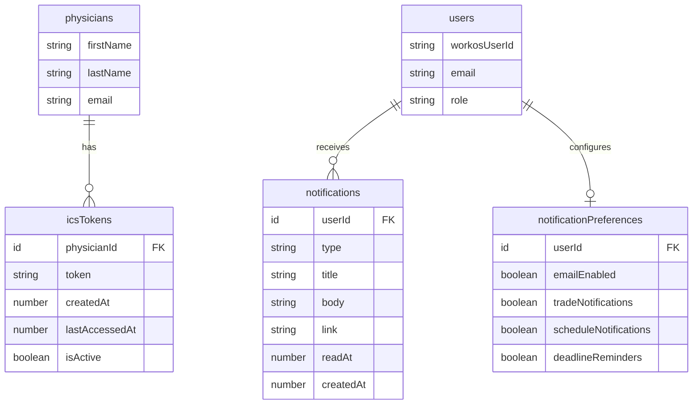

# UI/UX Overhaul -- Physician-First Scheduling Experience

## Overview

Complete frontend redesign of the Rush PCCM Calendar Assistant, transforming a 4,092-line monolithic dashboard (`src/features/dashboard/components/App.tsx`) into a role-aware, component-driven scheduling application. The overhaul introduces shadcn/ui as the component library, URL-routed admin pages, a hybrid calendar view, a guided schedule request wizard, admin reports, live ICS subscriptions, and a notification system.

**Primary persona:** Physicians (infrequent use -- view calendar, submit annual preferences, trade shifts)
**Secondary persona:** Admins (intensive use during scheduling season -- build calendar, review requests, analyze reports)

## Problem Statement

The current app has critical UX and architecture problems:

1. **Monolithic dashboard** -- 4,092 lines in `src/features/dashboard/components/App.tsx` with 24+ inline components, no code splitting, no URL routing for admin tabs
2. **No component library** -- All UI is hand-written Tailwind CSS with duplicate components (e.g., `StatusBadge` defined twice with different color mappings)
3. **No shared primitives** -- No reusable Button, Card, Table, Modal, Select, or Badge components
4. **Not mobile-friendly** -- 52-week grid is unusable on mobile, no responsive navigation
5. **Missing features** -- No calendar subscription, no reports, no notifications, no schedule request wizard
6. **Accessibility gaps** -- Green/yellow/red availability uses color only (fails WCAG 2.1 SC 1.4.1), no keyboard navigation for calendar grid

## Proposed Solution

A phased overhaul across 9 implementation phases, each independently deployable:

1. **Foundation** -- shadcn/ui setup, Rush brand theming, shared component library
2. **Layout Shell** -- Sidebar navigation, responsive layout, route structure
3. **Physician Calendar** -- Hybrid year/month views with "My Calendar" and "Department Calendar"
4. **Schedule Request Wizard** -- 3-step guided flow for annual preferences
5. **Admin Route Decomposition** -- Break monolith into URL-routed admin pages
6. **Admin Reports** -- 5 report types with charts and data visualization
7. **Trades Redesign** -- Update trades page to use new component library and sidebar layout
8. **ICS Calendar Subscription** -- Live iCal URLs via Convex HTTP actions
9. **Notification System** -- In-app notification center + email notifications

## Technical Approach

### Architecture

```
src/
  app/
    layout.tsx                     # Root layout (Providers + ThemeProvider)
    page.tsx                       # Landing/sign-in (unchanged)
    (authenticated)/               # Route group with sidebar layout
      layout.tsx                   # SidebarProvider + AppSidebar + MobileNav
      calendar/
        page.tsx                   # Hybrid calendar (year overview + month zoom)
      preferences/
        page.tsx                   # Schedule request wizard
      trades/
        page.tsx                   # Redesigned trades page
      profile/
        page.tsx                   # Profile + ICS + notification prefs
      admin/
        page.tsx                   # Admin dashboard overview
        calendar/page.tsx          # Master calendar editor
        rotations/page.tsx         # Rotation & clinic type CRUD
        cfte/page.tsx              # cFTE target management
        requests/page.tsx          # Schedule request queue + trade approval
        reports/page.tsx           # Reports & analytics
        audit/page.tsx             # Audit log viewer
        settings/page.tsx          # FY lifecycle, physician roster, config
  components/
    ui/                            # shadcn/ui components (auto-generated)
    layout/
      app-sidebar.tsx              # Main sidebar component
      mobile-nav.tsx               # Bottom tab bar for mobile
      page-header.tsx              # Consistent page header with breadcrumbs
    calendar/
      year-overview.tsx            # 52-week compact grid
      month-detail.tsx             # Monthly calendar detail view
      calendar-cell.tsx            # Individual week/day cell
      calendar-legend.tsx          # Color legend for rotations
      fy-selector.tsx              # Fiscal year dropdown
    wizard/
      wizard-shell.tsx             # Progress bar + step container
      week-availability-step.tsx   # Step 1: 52-week availability grid
      rotation-preference-step.tsx # Step 2: Rotation ranking
      review-submit-step.tsx       # Step 3: Summary + submit
    reports/
      holiday-coverage-report.tsx
      rotation-distribution-report.tsx
      cfte-compliance-report.tsx
      trade-activity-report.tsx
      yoy-trends-report.tsx
    notifications/
      notification-bell.tsx        # Bell icon + badge count
      notification-center.tsx      # Dropdown notification list
    shared/
      status-badge.tsx             # Unified status badge (replaces 2 duplicates)
      availability-indicator.tsx   # Green/yellow/red with icons (accessible)
      metric-card.tsx              # Stat card for dashboards
      empty-state.tsx              # Empty state placeholder
      loading-skeleton.tsx         # Skeleton loaders for Convex queries
  lib/
    utils.ts                       # cn() utility (shadcn standard)
  hooks/
    use-fiscal-year.ts             # FY context hook
    use-user-role.ts               # Role-based rendering hook
    use-notifications.ts           # Notification badge count hook
```

### Implementation Phases

---

#### Phase 1: Foundation -- shadcn/ui Setup and Rush Brand Theming

**Goal:** Install shadcn/ui, configure Rush brand colors as CSS variables, create the component foundation.

**Critical constraint:** Must use `shadcn@2.3.0` (NOT latest) because the project uses Tailwind CSS v3. The latest shadcn CLI generates Tailwind v4 configuration (oklch colors, `@theme inline`) which is incompatible.

##### Tasks

- [x] Back up `tailwind.config.js` and `src/index.css` before running shadcn init
- [x] Run `npx shadcn@2.3.0 init` with config: style=new-york, baseColor=neutral, cssVariables=yes, rsc=yes
- [x] Merge Rush brand colors back into `tailwind.config.js` (preserve `rush.*` color palette, semantic aliases, custom fonts, spacing)
- [x] Convert Rush brand colors to raw HSL for shadcn CSS variables in `src/index.css`:

```css
/* Light mode */
--primary: 152 100% 19%;           /* Rush Legacy Green #006332 */
--primary-foreground: 0 0% 100%;
--accent: 47 100% 50%;             /* Rush Gold #FFC600 */
--background: 135 18% 96%;         /* Light Sage #F2F6F3 */
--chart-1: 152 100% 19%;           /* Legacy Green */
--chart-2: 47 100% 50%;            /* Gold */
--chart-3: 199 58% 58%;            /* Cerulean Blue */
--chart-4: 153 69% 52%;            /* Vitality Green */
--chart-5: 197 100% 28%;           /* Deep Blue */

/* Dark mode (.dark) */
--primary: 153 69% 52%;            /* Vitality Green in dark */
--background: 152 20% 7%;
```

- [x] Add sidebar CSS variables for both light and dark modes
- [x] Install `next-themes` for dark mode (`npm install next-themes --legacy-peer-deps`)
- [x] Create `src/components/theme-provider.tsx` wrapping `NextThemesProvider` with `attribute="class"`
- [x] Update `src/app/layout.tsx` to use ThemeProvider (replaces existing inline theme script)
- [x] Remove custom `src/config/theme.ts` (replaced by next-themes)
- [x] Remove `src/shared/components/theme/ThemeToggle.tsx` (replaced by shadcn ModeToggle)
- [x] Install core shadcn components:

```bash
npx shadcn@2.3.0 add button card badge dialog sheet tabs sidebar \
  dropdown-menu table form input select textarea checkbox label \
  separator skeleton tooltip avatar command sonner chart
```

- [x] Add to `package.json` overrides for React 19 compatibility:

```json
"overrides": { "react-is": "^19.0.0" }
```

- [x] Install additional deps: `npm install @tanstack/react-table @hookform/resolvers react-hook-form zod recharts lucide-react --legacy-peer-deps`
- [x] Move existing `cn()` from `src/shared/utils/utils.ts` to `src/lib/utils.ts` (shadcn standard location)
- [x] Update barrel export in `src/shared/index.ts` to re-export from new location
- [x] Create unified `src/components/shared/status-badge.tsx` replacing both duplicate StatusBadge components
- [x] Create `src/components/shared/availability-indicator.tsx` with icons alongside colors (checkmark/warning/x) for WCAG compliance
- [x] Create `src/components/shared/metric-card.tsx` using shadcn Card
- [x] Create `src/components/shared/loading-skeleton.tsx` using shadcn Skeleton
- [x] Create `src/components/shared/empty-state.tsx` for empty data states
- [x] Verify TypeScript: `tsc -p convex -noEmit && tsc -p . -noEmit`
- [x] Verify tests: `npx vitest run`

**Files created:**
- `components.json` (project root)
- `src/lib/utils.ts`
- `src/components/ui/*.tsx` (all shadcn components)
- `src/components/theme-provider.tsx`
- `src/components/shared/status-badge.tsx`
- `src/components/shared/availability-indicator.tsx`
- `src/components/shared/metric-card.tsx`
- `src/components/shared/loading-skeleton.tsx`
- `src/components/shared/empty-state.tsx`

**Files modified:**
- `tailwind.config.js` (shadcn color tokens + Rush brand merge)
- `src/index.css` (shadcn CSS variables with Rush HSL values)
- `src/app/layout.tsx` (ThemeProvider wrapping)
- `package.json` (new deps + overrides)

**Files removed:**
- `src/config/theme.ts`
- `src/shared/components/theme/ThemeToggle.tsx`

**Success criteria:**
- [x] `npx shadcn@2.3.0 add button` installs without errors
- [x] Button renders with Rush Legacy Green as primary color
- [x] Dark mode toggle works with proper Rush dark palette
- [x] All existing tests pass
- [x] Both tsconfig builds pass

---

#### Phase 2: Layout Shell -- Sidebar Navigation and Route Structure

**Goal:** Create the authenticated layout with collapsible sidebar, mobile bottom tabs, and the route structure for all pages.

##### Tasks

- [x] Create route group `src/app/(authenticated)/layout.tsx` with:
  - SidebarProvider wrapping children
  - AppSidebar component (collapsible="icon" for desktop, sheet for mobile)
  - MobileNav component (bottom tab bar, hidden on md+)
  - SidebarTrigger in the main content area header
- [x] Create `src/components/layout/app-sidebar.tsx`:
  - SidebarHeader: Rush logo + "PCCM Calendar" text
  - SidebarContent with two SidebarGroups:
    - "Scheduling" group: Calendar, Preferences (conditional on FY collecting status), Trades, Profile
    - "Admin" group (conditionally rendered for admin role): Dashboard, Master Calendar, Rotations, cFTE, Requests, Reports, Audit, Settings
  - SidebarFooter: User avatar + name, role badge, ModeToggle, sign out button
  - Active link highlighting using `usePathname()`
  - Notification badge on bell icon in header
- [x] Create `src/components/layout/mobile-nav.tsx`:
  - Fixed bottom bar, visible only on mobile (`md:hidden`)
  - 4 tabs for physicians: Calendar, Preferences, Trades, Profile
  - 5 tabs for admins: Calendar, Admin, Trades, Profile, More (overflow menu)
  - Active tab indicator
- [x] Create `src/components/layout/page-header.tsx`:
  - Consistent page title + optional breadcrumbs + optional actions slot
- [x] Create `src/hooks/use-user-role.ts`:
  - Wraps Convex `loggedInUser` query
  - Returns `{ role, isAdmin, isPhysician, isViewer, physicianId, isLoading }`
- [x] Create `src/hooks/use-fiscal-year.ts`:
  - Wraps Convex `getCurrentFiscalYear` query
  - Returns `{ fiscalYear, isCollecting, isBuilding, isPublished, isLoading }`
- [x] Create placeholder pages (minimal "Coming soon" with PageHeader):
  - `src/app/(authenticated)/calendar/page.tsx`
  - `src/app/(authenticated)/preferences/page.tsx`
  - `src/app/(authenticated)/trades/page.tsx`
  - `src/app/(authenticated)/profile/page.tsx`
  - `src/app/(authenticated)/admin/page.tsx`
  - `src/app/(authenticated)/admin/calendar/page.tsx`
  - `src/app/(authenticated)/admin/rotations/page.tsx`
  - `src/app/(authenticated)/admin/cfte/page.tsx`
  - `src/app/(authenticated)/admin/requests/page.tsx`
  - `src/app/(authenticated)/admin/reports/page.tsx`
  - `src/app/(authenticated)/admin/audit/page.tsx`
  - `src/app/(authenticated)/admin/settings/page.tsx`
- [x] Update `src/middleware.ts` route protection:

```typescript
const routeRoleRequirements: Array<{ prefix: string; role: AppRole }> = [
  { prefix: "/admin", role: "admin" },
  { prefix: "/preferences", role: "physician" },
  { prefix: "/trades", role: "physician" },
  // /calendar and /profile: any authenticated user (no additional role)
];
```

- [x] Update `src/app/page.tsx` to redirect authenticated users to `/calendar` instead of `/dashboard`
- [x] Add redirect from `/dashboard` to `/calendar` for backwards compatibility
- [x] Verify sidebar collapses to icon-only on desktop toggle
- [x] Verify mobile bottom tabs render correctly on small screens
- [x] Verify admin sections are hidden for physician role

**Files created:**
- `src/app/(authenticated)/layout.tsx`
- `src/components/layout/app-sidebar.tsx`
- `src/components/layout/mobile-nav.tsx`
- `src/components/layout/page-header.tsx`
- `src/hooks/use-user-role.ts`
- `src/hooks/use-fiscal-year.ts`
- All placeholder page files (12 pages)

**Files modified:**
- `src/middleware.ts` (new route requirements)
- `src/app/page.tsx` (redirect target)

**Success criteria:**
- [x] Sidebar renders with correct links for each role
- [x] Mobile bottom tabs show on viewport < 768px
- [x] Admin routes return 403 for physician users
- [x] Sidebar collapse state persists via localStorage
- [x] All pages accessible via URL (bookmarkable)

---

#### Phase 3: Physician Calendar -- Hybrid Year/Month Views

**Goal:** Build the physician-facing calendar with year-at-a-glance overview and month detail zoom.

##### Backend changes

- [x] Create `convex/functions/masterCalendar.ts:getPublishedCalendarByFiscalYear` query (replaces separate reports.ts):
  - Args: `{ fiscalYearId: v.id("fiscalYears") }`
  - Returns: full grid with assignments, rotations, weeks, and calendar events
  - Client-side filtering for "My Calendar" vs "Department Calendar"
- [x] Reuse existing `getFiscalYears` query (already returns all FYs):
  - Used for FY selector dropdown and historical calendar viewing

##### Frontend changes

- [x] Create `src/components/calendar/fy-selector.tsx`:
  - shadcn Select dropdown listing all fiscal years
  - Default to current/active FY
  - Shows status badge (published, archived, etc.)
- [x] Create `src/components/calendar/calendar-legend.tsx`:
  - Color-coded rotation legend with abbreviations
  - Shows rotation name, abbreviation, and assigned color
- [x] Create `src/components/calendar/year-overview.tsx`:
  - 52-week compact grid (52 columns x rotations)
  - Each cell: color-coded by rotation type with physician initials
  - Holiday/conference markers as dots
  - Click a week header to zoom to month detail
  - "My Calendar" mode: only physician's own cells colored, others dimmed
  - "Department Calendar" mode: all cells colored
  - **Mobile layout**: Vertical scrollable list of week cards (rotation + date range + events)
- [x] Create `src/components/calendar/month-detail.tsx`:
  - Weekly card layout grouped by month
  - Each week shows rotation assignments with color coding
  - Holiday/conference events displayed with full names
  - Navigation arrows for month-to-month browsing
  - Week appears in the month of its Monday start date
- [x] Create `src/components/calendar/calendar-cell.tsx`:
  - Reusable cell for year overview grid
  - Shows physician initials
  - Hover tooltip with full details (shadcn Tooltip)
  - ARIA gridcell role
- [x] Implement `src/app/(authenticated)/calendar/page.tsx`:
  - Toggle between "My Calendar" and "Department Calendar" (shadcn Tabs)
  - Toggle between Year Overview and Month Detail views
  - FY selector dropdown
  - Loading skeleton while Convex query resolves
- [x] Add ARIA attributes for calendar grid:
  - `role="grid"`, `role="row"`, `role="gridcell"` on year overview

**Files created:**
- `src/components/calendar/year-overview.tsx`
- `src/components/calendar/month-detail.tsx`
- `src/components/calendar/calendar-cell.tsx`
- `src/components/calendar/calendar-legend.tsx`
- `src/components/calendar/fy-selector.tsx`
- `src/app/(authenticated)/calendar/page.tsx` (replace placeholder)

**Files modified:**
- `convex/functions/fiscalYears.ts` (add `getAllFiscalYears`)
- `convex/functions/reports.ts` (new file, `getPhysicianAssignments`)

**Success criteria:**
- [x] Year overview renders 52 weeks with correct rotation colors
- [x] "My Calendar" shows only the physician's assignments
- [x] "Department Calendar" shows all physicians
- [x] Month zoom navigates correctly across FY boundaries
- [x] Calendar is keyboard-navigable (ARIA roles)
- [x] Mobile shows vertical week list instead of grid
- [x] Past FY calendars viewable via FY selector

---

#### Phase 4: Schedule Request Wizard

**Goal:** Replace the inline preference editing with a guided 3-step wizard for annual schedule request submission.

##### Backend changes

- [x] Create `batchSetWeekPreferences` mutation in `convex/functions/scheduleRequests.ts`:
  - Args: array of `{ weekId, availability, reasonCategory?, reasonText? }`
  - Sets all week preferences in a single atomic transaction
  - Replaces 52 individual `setMyWeekPreference` calls
- [x] Add week preference validation to `submitMyScheduleRequest`:
  - Require at least 1 week preference exists, or explicit "all available" confirmation
  - Return validation errors with specific messages

##### Frontend changes

- [x] Create `src/components/wizard/wizard-shell.tsx`:
  - Progress bar showing 3 steps (shadcn custom stepper using badges + separator)
  - Step labels: "Week Availability", "Rotation Preferences", "Review & Submit"
  - Back/Next navigation buttons
  - Auto-save indicator ("Draft saved" / "Saving...")
  - Mobile-friendly vertical layout
- [x] Create `src/components/wizard/week-availability-step.tsx`:
  - 52-week grid with green/yellow/red toggle per week
  - Each row: week number, date range, calendar events (holidays in that week), availability toggle
  - Availability toggle uses `AvailabilityIndicator` (icons + colors for WCAG)
  - Optional reason category dropdown and reason text for yellow/red weeks
  - Bulk actions: "Mark all as Available", "Import from file" (existing react-dropzone)
  - Debounced auto-save (300ms after last interaction) using `batchSetWeekPreferences`
  - **Mobile**: Vertical card list, each card = 1 week with expandable reason fields
- [x] Create `src/components/wizard/rotation-preference-step.tsx`:
  - Card per rotation showing: rotation name, description, cFTE per week
  - Preference options: Preferred (with rank 1-N), Willing, Prefer Not, Do Not Assign
  - If "Do Not Assign", show reason text field
  - Completion indicator: "X of Y rotations configured"
  - Auto-save each preference change
- [x] Create `src/components/wizard/review-submit-step.tsx`:
  - Summary view:
    - Week availability breakdown (X green, Y yellow, Z red)
    - Mini calendar heatmap of availability
    - Rotation preferences table
    - Special requests text area (editable)
  - Validation warnings (e.g., "You marked 0 weeks as unavailable -- is this correct?")
  - Submit button with confirmation dialog
  - Post-submission: success state with "Return to Calendar" link
- [x] Implement `src/app/(authenticated)/preferences/page.tsx`:
  - Loads existing schedule request (draft/submitted/revised)
  - If no request exists, creates draft on first interaction
  - Shows wizard shell with appropriate starting step
  - If FY is not in "collecting" status, shows read-only view with banner
  - Reactive FY status monitoring: if collecting closes mid-session, show banner immediately
- [x] Handle re-entry after submission:
  - Show submitted data in wizard
  - Any edit transitions status to "revised"
  - "Re-submit" button appears

**Files created:**
- `src/components/wizard/wizard-shell.tsx`
- `src/components/wizard/week-availability-step.tsx`
- `src/components/wizard/rotation-preference-step.tsx`
- `src/components/wizard/review-submit-step.tsx`
- `src/app/(authenticated)/preferences/page.tsx` (replace placeholder)

**Files modified:**
- `convex/functions/scheduleRequests.ts` (add `batchSetWeekPreferences`, update validation)

**Success criteria:**
- [x] Wizard navigates through all 3 steps
- [x] Week availability auto-saves with debounce
- [x] Rotation preferences validate mutual exclusivity
- [x] Submit validates both week and rotation completeness
- [x] Re-entry after submission shows existing data
- [x] Read-only mode when FY is not collecting
- [x] Mobile-friendly layout for all 3 steps

---

#### Phase 5: Admin Route Decomposition -- Breaking the Monolith

**Goal:** Extract all admin functionality from the 4,092-line `App.tsx` into dedicated URL-routed pages using shadcn components.

##### Tasks

- [x] Extract `AdminMasterCalendarPage` (lines 1211-1823) to `src/app/(authenticated)/admin/calendar/page.tsx`:
  - Use shadcn Table for the 52-week grid
  - Use shadcn Select for physician assignment dropdowns
  - Use shadcn Dialog for confirmation modals (publish, auto-assign)
  - Use shadcn Sheet for cell detail editing
  - Keep drag-and-drop functionality
  - Add loading skeletons for Convex queries
- [x] Extract `AdminRotationsPage` (lines 492-682) + `AdminClinicTypesPage` (lines 683-854) to `src/app/(authenticated)/admin/rotations/page.tsx`:
  - Use shadcn Tabs to switch between Rotations and Clinic Types
  - Use shadcn Table + Form for CRUD operations
  - Use shadcn Dialog for create/edit modals
- [x] Extract `AdminCfteTargetsPage` (lines 855-1001) to `src/app/(authenticated)/admin/cfte/page.tsx`:
  - Use shadcn Table for physician-cFTE matrix
  - Inline editing with shadcn Input
- [x] Extract `AdminClinicAssignmentsPage` (lines 1002-1210) to `src/app/(authenticated)/admin/cfte/page.tsx` (as tab alongside cFTE):
  - Physician-clinic assignment matrix
  - Inline editing
- [x] Extract `AdminRequestQueue` (lines 3445-3515) + `AdminTradeQueue` (lines 3516-3591) + `AdminRotationPreferencePanel` (lines 2875-3200) + `AdminWeekPreferenceImportPanel` (lines 3201-3444) to `src/app/(authenticated)/admin/requests/page.tsx`:
  - Use shadcn Tabs: "Schedule Requests", "Trade Approval", "Preference Matrix", "Bulk Import"
  - Use TanStack Table for sortable, filterable request lists
- [x] Extract `AdminAuditLogPage` (lines 1824-1976) to `src/app/(authenticated)/admin/audit/page.tsx`:
  - Use TanStack Table with pagination, column sorting, and filtering
  - Use shadcn Collapsible for expandable JSON diff views
- [x] Extract `AdminActions` (lines 3669-4048) + `BootstrapSetup` (lines 3652-3668) to `src/app/(authenticated)/admin/settings/page.tsx`:
  - FY lifecycle management (create FY, set deadline, transition status)
  - Holiday/conference import actions
  - Physician roster management
  - Seed data tools (dev only)
- [x] Create `src/app/(authenticated)/admin/page.tsx` (admin overview dashboard):
  - MetricCards: total physicians, submitted requests, pending trades, cFTE compliance %
  - Quick links to key admin actions
  - FY status and deadline
- [ ] After all extractions complete, reduce `App.tsx` to a thin redirect/compatibility wrapper or delete it entirely
- [ ] Remove `src/app/dashboard/page.tsx` (replaced by new route structure)
- [ ] Add redirect: `/dashboard` -> `/calendar`

**Files created:**
- `src/app/(authenticated)/admin/page.tsx` (admin overview)
- `src/app/(authenticated)/admin/calendar/page.tsx`
- `src/app/(authenticated)/admin/rotations/page.tsx`
- `src/app/(authenticated)/admin/cfte/page.tsx`
- `src/app/(authenticated)/admin/requests/page.tsx`
- `src/app/(authenticated)/admin/audit/page.tsx`
- `src/app/(authenticated)/admin/settings/page.tsx`

**Files modified/removed:**
- `src/features/dashboard/components/App.tsx` (decomposed and eventually removed)
- `src/app/dashboard/page.tsx` (removed, replaced by redirect)

**Success criteria:**
- [x] Every admin tab is now a URL-routed page
- [x] All existing admin functionality preserved (CRUD, drag-drop, import, export)
- [ ] `App.tsx` is deleted or reduced to < 50 lines
- [x] No functionality regression (verify all Convex queries still work)
- [x] Admin pages use shadcn components consistently

---

#### Phase 6: Admin Reports -- Analytics Dashboard

**Goal:** Build 5 report types with interactive charts and data tables for admin insights.

##### Backend changes (new file: `convex/functions/reports.ts`)

- [x] `getHolidayCoverageReport` query:
  - Args: `{ fiscalYearIds: v.array(v.id("fiscalYears")) }`
  - Joins assignments + weeks + calendarEvents (federal_holiday category) + physicians
  - Returns: per-physician, per-holiday, per-year assignment data
  - Includes fairness score (round-robin equity calculation)
- [x] `getRotationDistributionReport` query:
  - Args: `{ fiscalYearId: v.id("fiscalYears") }`
  - Aggregates weeks per rotation per physician from assignments table
  - Returns: physician x rotation matrix with week counts
- [x] `getCfteComplianceReport` query:
  - Args: `{ fiscalYearId: v.id("fiscalYears") }`
  - Calculates actual cFTE from assignments (rotation.cftePerWeek * weeks assigned) + clinics (clinicType.cftePerHalfDay * halfDaysPerWeek)
  - Compares to physicianCfteTargets.targetCfte
  - Returns: per-physician actual vs target with variance
- [x] `getTradeActivityReport` query:
  - Args: `{ fiscalYearId: v.id("fiscalYears") }`
  - Aggregates tradeRequests by status, physician, resolution time
  - Returns: volume, approval rates, avg resolution time, most active traders
- [x] `getYearOverYearReport` query:
  - Args: `{ fiscalYearIds: v.array(v.id("fiscalYears")) }`
  - Multi-FY rotation distribution comparison
  - Returns: per-physician, per-rotation, per-FY week counts

##### Frontend changes

- [x] Create `src/components/reports/holiday-coverage-report.tsx`:
  - Bar chart: holidays on X-axis, physicians color-coded
  - Multi-year toggle for fairness comparison
  - Equity indicator badges (fair/overloaded/underloaded)
  - Data table with sortable columns
- [x] Create `src/components/reports/rotation-distribution-report.tsx`:
  - Heatmap: physicians (rows) x rotations (columns), intensity = weeks
  - Bar chart alternative view
  - Equity analysis sidebar
- [x] Create `src/components/reports/cfte-compliance-report.tsx`:
  - Grouped bar chart: actual vs target per physician
  - Variance highlighting (green = within range, red = over/under)
  - Summary metrics: % compliant, avg variance
- [x] Create `src/components/reports/trade-activity-report.tsx`:
  - Line chart: trade volume over time
  - Pie chart: approval/denial breakdown
  - Top traders table
- [x] Create `src/components/reports/yoy-trends-report.tsx`:
  - Multi-series line chart: rotation weeks per physician across FYs
  - Stacked bar chart: workload distribution comparison
- [x] Implement `src/app/(authenticated)/admin/reports/page.tsx`:
  - shadcn Tabs for 5 report types
  - FY selector (multi-select for cross-year reports)
  - Export to CSV button per report
  - Print stylesheet for report pages

**Files created:**
- `convex/functions/reports.ts`
- `src/components/reports/*.tsx` (5 report components)
- `src/app/(authenticated)/admin/reports/page.tsx` (replace placeholder)

**Success criteria:**
- [x] All 5 report types render with real data
- [x] Charts use Rush brand colors (via CSS variables)
- [x] Multi-FY selection works for holiday coverage and YoY reports
- [ ] Reports are printable (print stylesheet deferred)
- [x] Export to CSV works

---

#### Phase 7: Trades Redesign

**Goal:** Update the trades page to use shadcn components and integrate with the new sidebar layout.

##### Tasks

- [ ] Rewrite `src/app/(authenticated)/trades/page.tsx` using shadcn components:
  - Remove duplicate header (now handled by sidebar layout)
  - Remove duplicate StatusBadge (use shared component)
  - Use shadcn Card for trade proposal form
  - Use shadcn Select with search (Command-based) for physician/assignment selection
  - Use shadcn Table (TanStack) for trade history with sorting and pagination
  - Use shadcn Badge for trade status chips
  - Use shadcn Dialog for trade confirmation
  - Use shadcn Sheet for trade detail view on mobile
- [ ] Keep existing 3-step workflow visualization but redesign with shadcn primitives
- [ ] Add "Action Needed" section using shadcn Alert component
- [ ] Mobile-optimized trade proposal flow (full-screen sheets instead of inline forms)
- [ ] Remove old `src/app/trades/page.tsx` (moved to new route group)

**Files modified:**
- `src/app/(authenticated)/trades/page.tsx` (full rewrite)

**Files removed:**
- `src/app/trades/page.tsx` (old location)

**Success criteria:**
- [ ] All trade functionality preserved
- [ ] Consistent styling with rest of app
- [ ] Mobile trade proposal works with touch-friendly controls
- [ ] Trade history searchable and sortable

---

#### Phase 8: ICS Calendar Subscription

**Goal:** Enable live iCal subscription URLs that auto-update when schedules change.

##### Backend changes

- [ ] Add `icsTokens` table to `convex/schema.ts`:

```typescript
icsTokens: defineTable({
  physicianId: v.id("physicians"),
  token: v.string(),
  createdAt: v.number(),
  lastAccessedAt: v.optional(v.number()),
  isActive: v.boolean(),
})
  .index("by_token", ["token"])
  .index("by_physicianId", ["physicianId"])
```

- [ ] Create ICS mutations in `convex/functions/icsTokens.ts`:
  - `generateIcsToken` mutation: creates UUID v4 token for authenticated physician
  - `revokeIcsToken` mutation: deactivates token
  - `getMyIcsToken` query: returns active token for current physician
- [ ] Create Convex HTTP action in `convex/http.ts`:
  - Route: `GET /ics/:token.ics`
  - Looks up token in `icsTokens` table
  - If valid, loads physician's published assignments + calendar events
  - Generates ICS content using adapted `buildMasterCalendarIcs` logic
  - Returns with `Content-Type: text/calendar` and `Cache-Control: no-cache`
  - Updates `lastAccessedAt` timestamp
  - If invalid token, returns 404

##### Frontend changes

- [ ] Create ICS management section in `src/app/(authenticated)/profile/page.tsx`:
  - "Calendar Subscription" card
  - If no token: "Generate Subscription URL" button
  - If token exists: display URL with copy button, "Revoke" button, last accessed date
  - Instructions for adding to Google Calendar / Apple Calendar / Outlook
- [ ] Keep existing static .ics download in calendar page export menu

**Files created:**
- `convex/functions/icsTokens.ts`
- `convex/http.ts` (or add route to existing if present)

**Files modified:**
- `convex/schema.ts` (add `icsTokens` table)
- `src/app/(authenticated)/profile/page.tsx`

**Success criteria:**
- [ ] Physician can generate a subscription URL
- [ ] URL returns valid .ics content when fetched
- [ ] Content updates when schedule is republished
- [ ] Token can be revoked
- [ ] Google Calendar / Apple Calendar can subscribe to the URL

---

#### Phase 9: Notification System

**Goal:** In-app notification center with badge counts + email notifications for key events.

##### Backend changes

- [ ] Add `notifications` and `notificationPreferences` tables to `convex/schema.ts`:

```typescript
notifications: defineTable({
  userId: v.id("users"),
  type: v.string(),
  title: v.string(),
  body: v.string(),
  link: v.optional(v.string()),
  readAt: v.optional(v.number()),
  createdAt: v.number(),
})
  .index("by_userId_createdAt", ["userId", "createdAt"])
  .index("by_userId_readAt", ["userId", "readAt"])

notificationPreferences: defineTable({
  userId: v.id("users"),
  emailEnabled: v.boolean(),
  tradeNotifications: v.boolean(),
  scheduleNotifications: v.boolean(),
  deadlineReminders: v.boolean(),
})
  .index("by_userId", ["userId"])
```

- [ ] Create `convex/functions/notifications.ts`:
  - `getMyNotifications` query (paginated, most recent first)
  - `getUnreadNotificationCount` query (lightweight, for badge)
  - `markNotificationRead` mutation
  - `markAllNotificationsRead` mutation
  - `getMyNotificationPreferences` query
  - `updateMyNotificationPreferences` mutation
- [ ] Create `convex/lib/notifications.ts` (internal helper):
  - `createNotification` internal mutation
  - `sendNotificationEmail` internal action (calls email provider API)
  - Notification trigger registry: maps event types to notification creation
- [ ] Add notification triggers to existing mutations:
  - `publishCurrentFiscalYearMasterCalendarDraft` -> notify all physicians: "FY27 schedule published"
  - `proposeTrade` -> notify target physician: "Trade request from Dr. X"
  - `respondToTrade` (accepted) -> notify admin: "Trade accepted, awaiting approval"
  - `adminResolveTrade` -> notify both physicians: "Trade approved/denied"
  - `updateFiscalYearStatus` (to collecting) -> notify all physicians: "FY27 request window open"
- [ ] Email provider integration (Resend recommended):
  - Install `resend` package
  - Configure API key as Convex environment variable
  - Create email templates for each notification type

##### Frontend changes

- [ ] Create `src/components/notifications/notification-bell.tsx`:
  - Bell icon (Lucide) with badge count from `getUnreadNotificationCount`
  - Click opens notification center dropdown
  - Placed in sidebar header
- [ ] Create `src/components/notifications/notification-center.tsx`:
  - shadcn DropdownMenu or Popover with scrollable notification list
  - Each notification: icon, title, body preview, timestamp, read/unread indicator
  - Click notification navigates to `link` and marks as read
  - "Mark all as read" action
  - "View all" link to full notification page (optional)
- [ ] Create `src/hooks/use-notifications.ts`:
  - Returns `{ unreadCount, notifications, markRead, markAllRead }`
  - Uses Convex reactive queries for real-time badge updates
- [ ] Add notification preferences to `src/app/(authenticated)/profile/page.tsx`:
  - Toggle switches for email categories
  - Email enable/disable master toggle

**Files created:**
- `convex/functions/notifications.ts`
- `convex/lib/notifications.ts`
- `src/components/notifications/notification-bell.tsx`
- `src/components/notifications/notification-center.tsx`
- `src/hooks/use-notifications.ts`

**Files modified:**
- `convex/schema.ts` (add `notifications` + `notificationPreferences` tables)
- `convex/functions/masterCalendar.ts` (add publish notification trigger)
- `convex/functions/tradeRequests.ts` (add trade notification triggers)
- `convex/functions/fiscalYears.ts` (add FY status change notification trigger)
- `src/components/layout/app-sidebar.tsx` (add notification bell)
- `src/app/(authenticated)/profile/page.tsx` (add notification preferences)
- `package.json` (add `resend` dependency)

**Success criteria:**
- [ ] Bell icon shows unread count in real-time
- [ ] Notification dropdown shows recent notifications
- [ ] Clicking notification navigates to relevant page
- [ ] Email sent for schedule published event
- [ ] Physician can disable email notifications
- [ ] Notification preferences persist

---

## Alternative Approaches Considered

### 1. Full rewrite vs. incremental migration
**Chosen: Incremental phased migration.** A full rewrite risks breaking existing functionality and has a longer time-to-value. The phased approach allows deploying improvements after each phase while maintaining the existing app as fallback.

### 2. MUI/Chakra vs. shadcn/ui
**Chosen: shadcn/ui.** MUI and Chakra are heavier dependencies with opinionated styling that would conflict with the Rush brand system. shadcn/ui gives us owned code, Radix accessibility primitives, and full control over theming.

### 3. FullCalendar library vs. custom calendar
**Chosen: Custom calendar.** FullCalendar and similar libraries are optimized for day-level event scheduling (think Google Calendar). This app needs a 52-week fiscal year grid with rotation assignments per week -- a fundamentally different layout that no off-the-shelf library handles well.

### 4. Tailwind v4 upgrade vs. staying on v3
**Chosen: Stay on Tailwind v3.** Upgrading to v4 would require migrating the entire CSS system (oklch colors, `@theme inline`, no config file). This is orthogonal to the UI/UX overhaul and should be a separate effort.

## Acceptance Criteria

### Functional Requirements

- [ ] Physician can view their annual calendar in year-at-a-glance and month detail modes
- [ ] Physician can toggle between "My Calendar" and "Department Calendar"
- [ ] Physician can submit schedule preferences through a 3-step wizard
- [ ] Physician can request and manage trades
- [ ] Physician can subscribe to a live-updating iCal feed
- [ ] Physician receives in-app and email notifications for key events
- [ ] Admin can manage all scheduling operations via dedicated URL-routed pages
- [ ] Admin can view 5 types of reports with interactive charts
- [ ] All functionality works on mobile (responsive layout)

### Non-Functional Requirements

- [ ] Accessibility: WCAG 2.1 Level AA compliance (color + icon indicators, keyboard navigation, ARIA attributes)
- [ ] Performance: Each page loads in < 2s on 3G (code splitting via Next.js route-based chunks)
- [ ] Dark mode: Full support with Rush brand dark palette
- [ ] TypeScript: Both tsconfigs pass with zero errors
- [ ] Tests: All existing Vitest tests continue to pass

### Quality Gates

- [ ] `npm run lint` passes (both tsconfigs + next build)
- [ ] `npm run test` passes (all Vitest tests)
- [ ] `npm run test:authz` passes (auth guard verification)
- [ ] No `as any` type erasure in new code
- [ ] All new Convex functions have `args` and `returns` validators
- [ ] All new Convex functions have auth guards

## Dependencies and Prerequisites

| Dependency | Required By | Status |
|------------|------------|--------|
| shadcn/ui + Tailwind v3 compat | Phase 1 | Researched, ready |
| next-themes | Phase 1 | npm package, ready |
| Recharts + shadcn chart | Phase 6 | npm package, ready |
| Resend (email) | Phase 9 | Requires API key setup |
| TanStack React Table | Phase 5, 6, 7 | npm package, ready |
| React Hook Form + Zod | Phase 4 | npm package, ready |

## Risk Analysis and Mitigation

| Risk | Impact | Probability | Mitigation |
|------|--------|-------------|------------|
| shadcn@2.3.0 breaks with React 19 | Blocks Phase 1 | Low | Use `--legacy-peer-deps`, fallback to manual component installation |
| Monolith decomposition breaks existing features | High | Medium | Extract one admin page at a time, test after each extraction, keep old code as reference |
| 52-week grid performance on mobile | Medium | Medium | Virtual scrolling for mobile list view, lazy load month detail |
| Concurrent admin editing conflicts | Medium | Low | Document limitation, consider optimistic locking in future sprint |
| Email provider rate limits | Low | Low | Queue notifications via Convex scheduled functions |

## Schema Changes (ERD)



## References and Research

### Internal References

- Brainstorm: `docs/brainstorms/2026-02-17-ui-ux-overhaul-brainstorm.md`
- Backend audit learnings: `docs/solutions/logic-errors/convex-backend-audit-type-safety-and-validators.md`
- Current monolith: `src/features/dashboard/components/App.tsx` (4,092 lines)
- Current trades page: `src/app/trades/page.tsx` (803 lines)
- Tailwind config: `tailwind.config.js` (Rush brand colors)
- Global styles: `src/index.css` (Rush design system CSS variables)
- Schema: `convex/schema.ts` (14 tables, all indexes)
- Middleware: `src/middleware.ts` (route protection patterns)
- ICS export: `src/shared/services/masterCalendarExport.ts` (existing .ics builder)
- Auth: `convex/auth.ts` (identity resolution query)

### External References

- shadcn/ui docs (Tailwind v3): https://v3.shadcn.com/docs
- shadcn/ui sidebar component: https://ui.shadcn.com/docs/components/sidebar
- shadcn/ui chart (Recharts): https://ui.shadcn.com/docs/components/chart
- shadcn/ui dark mode (Next.js): https://ui.shadcn.com/docs/dark-mode/next
- React 19 compatibility: https://ui.shadcn.com/docs/react-19
- next-themes: https://github.com/pacocoursey/next-themes
- TanStack Table: https://tanstack.com/table
- Resend (email): https://resend.com/docs
- WCAG 2.1 SC 1.4.1 (Use of Color): https://www.w3.org/WAI/WCAG21/Understanding/use-of-color
